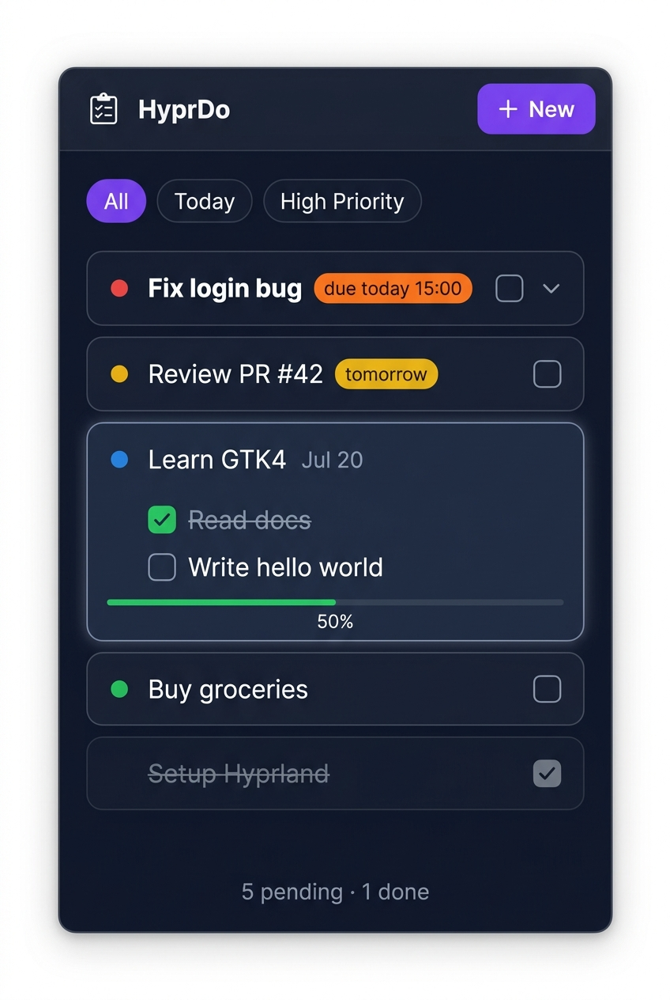
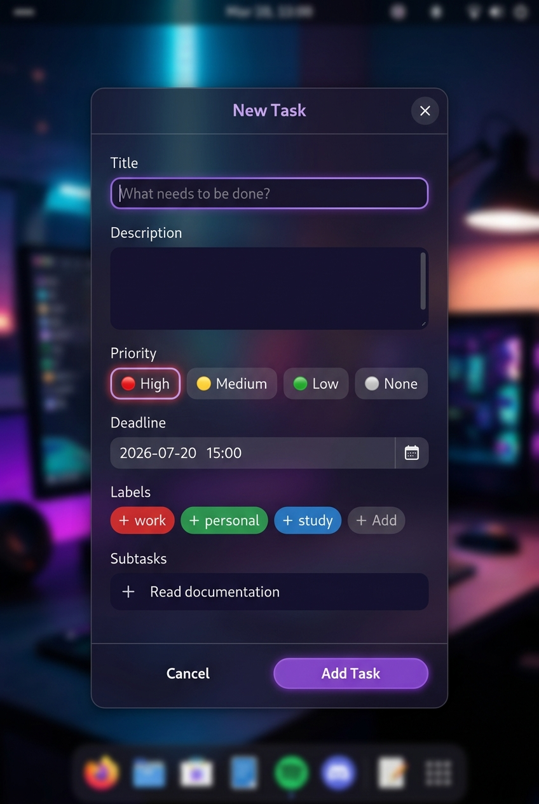

# HyprDo — Wireframe & UI Specification

> **Version**: 0.1.0  
> **Author**: boemi  
> **Created**: 2026-07-15  
> **Status**: Draft

---

## 1. Overview

Dokumen ini mendeskripsikan layout, komponen, dan behavior UI dari HyprDo. Digunakan sebagai panduan implementasi GTK4.

---

## 2. Screens

HyprDo memiliki **3 screen / view utama**:

| Screen | Deskripsi |
|---|---|
| **Main Window** | Floating panel utama berisi task list |
| **Add/Edit Task Dialog** | Modal untuk tambah atau edit task |
| **Waybar Module** | Icon + badge di taskbar |

---

## 3. Main Window

### 3.1 Mockup (v2 — revised palette)



### 3.2 Spesifikasi

| Property | Value |
|---|---|
| Window type | Floating (Hyprland scratchpad) |
| Default size | 440 × 620 px |
| Position | Center screen |
| Resizable | Ya (min: 380×400) |
| Decoration | Custom headerbar (libadwaita) |
| Background | Semi-transparent dark + blur |

### 3.3 Layout (top → bottom)

```
┌──────────────────────────────────────┐
│  HEADERBAR                           │
│  [🗒 HyprDo]   [Filter ▾]   [  +  ] │
├──────────────────────────────────────┤
│  FILTER TABS                         │
│  [ All ] [ Today ] [ High Priority ] │
├──────────────────────────────────────┤
│  TASK LIST (scrollable)              │
│  ┌────────────────────────────────┐  │
│  │ ● Fix login bug  [due:today] › │  │
│  ├────────────────────────────────┤  │
│  │ ● Review PR #42  [tomorrow]    │  │
│  ├────────────────────────────────┤  │
│  │ ● Learn GTK4         Jul 20    │  │
│  │   └ ☑ Read docs               │  │
│  │   └ ☐ Write hello world       │  │
│  │   ████░░░░░░ 50%              │  │
│  ├────────────────────────────────┤  │
│  │ ● Buy groceries                │  │
│  ├────────────────────────────────┤  │
│  │ ~~Setup Hyprland~~        ☑   │  │
│  └────────────────────────────────┘  │
├──────────────────────────────────────┤
│  FOOTER: "5 pending · 1 done"        │
└──────────────────────────────────────┘
```

### 3.4 Headerbar

| Element | Behavior |
|---|---|
| **App icon + Title** | Klik → tidak ada aksi |
| **Filter dropdown** | Dropdown: sort by Priority / Deadline / Created |
| **+ button** | Klik → buka Add Task Dialog |

### 3.5 Filter Tabs

Pill-shaped toggle buttons:

| Tab | Query |
|---|---|
| All | `status = 'todo'` |
| Today | `deadline LIKE 'today%'` OR `date(deadline) = date('now')` |
| High Priority | `priority = 'high' AND status = 'todo'` |

### 3.6 Task Row (collapsed)

```
[priority dot] [title]   [deadline badge?]  [expand ›] [checkbox]
```

- **Priority dot**: 🔴 high / 🟡 medium / 🟢 low / ⚪ none
- **Deadline badge**:
  - 🟠 "due: today HH:MM" — jika deadline = hari ini
  - 🟡 "due: tomorrow" — jika deadline = besok
  - 🔴 "overdue!" — jika deadline sudah lewat
  - (kosong) — jika tidak ada deadline atau > 2 hari
- **Expand arrow**: hanya muncul jika task punya subtask
- **Checkbox**: klik → mark done (dengan animasi strikethrough)

### 3.7 Task Row (expanded — dengan subtask)

```
[priority dot] [title]                    [deadline]
    └ [☑] Subtask 1 (done)
    └ [☐] Subtask 2
    [████░░░░] 50%
```

- Expand/collapse dengan animasi smooth
- Progress bar: jumlah subtask done / total subtask

### 3.8 Task Row — States

| State | Visual |
|---|---|
| Normal | Dark card background |
| Hover | Slightly lighter background, cursor pointer |
| Active/pressed | Slightly darker |
| Done | Strikethrough title, reduced opacity (0.5), greyed dot |
| Overdue | Red border atau red tint subtle |

### 3.9 Footer

```
"5 pending · 1 done"
```

Update realtime setiap kali task status berubah.

---

## 4. Add / Edit Task Dialog

### 4.1 Mockup



### 4.2 Spesifikasi

| Property | Value |
|---|---|
| Dialog type | Modal (blocks main window) |
| Size | 440 × auto (max 700px) |
| Trigger | Klik tombol "+" di headerbar |
| Close | Klik X / tekan Escape / klik Cancel |

### 4.3 Form Fields

| Field | Type | Required | Validasi |
|---|---|---|---|
| Title | Text input | ✅ Ya | min 1 char, max 200 |
| Description | Textarea | ❌ Opsional | max 1000 chars |
| Priority | Radio pills | ❌ Opsional | default: None |
| Deadline | DateTime picker | ❌ Opsional | tidak boleh di masa lalu |
| Labels | Multi-select chips | ❌ Opsional | max 5 labels |
| Subtasks | Dynamic list | ❌ Opsional | max 20 subtask |

### 4.4 Priority Pills

4 pill buttons horizontal:

```
[🔴 High]  [🟡 Medium]  [🟢 Low]  [⚪ None]
```

Saat dipilih: pill mendapat border glow sesuai warna priority.

### 4.5 Labels

Tampil sebagai chips yang bisa diklik (toggle on/off). Ada tombol "+ New Label" untuk buat label baru inline.

### 4.6 Subtasks

Dynamic list — user bisa:
- Tekan Enter untuk tambah subtask baru
- Klik ✕ di sebelah kanan untuk hapus
- Drag to reorder (future v2)

### 4.7 Buttons

| Button | Style | Aksi |
|---|---|---|
| Cancel | Ghost/outline | Tutup dialog tanpa simpan |
| Add Task | Solid purple pill | Validasi → simpan → tutup → refresh list |

### 4.8 Edit Mode

Dialog yang sama digunakan untuk edit task:
- Title bar berubah jadi "Edit Task"
- Semua field pre-filled dengan data existing
- Tombol "Add Task" berubah jadi "Save Changes"
- Ada tombol "Delete Task" (destructive, merah) di kiri bawah

---

## 5. Waybar Module

### 5.1 Tampilan Normal

```
[󰄲  5]
```

- Icon: `󰄲` (Nerd Font checklist icon)
- Number: jumlah task pending
- Tooltip (hover): judul task High priority paling dekat deadlinenya

### 5.2 Tampilan States

| State | Tampilan | CSS class |
|---|---|---|
| Ada task pending | `󰄲  5` | `has-tasks` |
| Tidak ada task | `󰄲` (icon saja) | `no-tasks` |
| Ada overdue task | `󰄲  3 ⚠` dengan warna merah | `has-overdue` |
| High priority ada | Accent color lebih terang | `has-high` |

### 5.3 Interaksi

| Aksi | Hasil |
|---|---|
| Klik kiri | Toggle show/hide HyprDo window |
| Klik kanan | (future) Quick-add task inline |
| Hover | Tooltip: nama task paling urgent |

---

## 6. Theme System

### 6.1 Color Variables (Final Palette — from ui-ux-pro-max audit)

> **Source**: Studio Dark palette — deep navy + violet + green. Validated for WCAG AA contrast.

| Variable | Value | Deskripsi |
|---|---|---|
| `--bg-primary` | `#0F172A` | Background utama window (deep navy) |
| `--bg-card` | `#192134` | Background task card |
| `--bg-card-hover` | `#1E2A40` | Background task card on hover |
| `--accent` | `#7C3AED` | Violet — tombol utama, active filter |
| `--accent-dim` | `#6366F1` | Indigo — secondary elements |
| `--accent-green` | `#22C55E` | Green — done state, progress bar |
| `--text-primary` | `#FFFFFF` | Teks utama |
| `--text-secondary` | `#94A3B8` | Teks sekunder (deadline, count) |
| `--text-done` | `#64748B` | Teks task selesai (strikethrough) |
| `--border` | `rgba(255,255,255,0.06)` | Border card |
| `--priority-high` | `#EF4444` | Dot High (red) |
| `--priority-medium` | `#EAB308` | Dot Medium (yellow) |
| `--priority-low` | `#22C55E` | Dot Low (green) |
| `--badge-today` | `#F97316` | Badge "due today" (orange) |
| `--badge-tomorrow` | `#EAB308` | Badge "tomorrow" (yellow) |
| `--badge-overdue` | `#EF4444` | Badge "overdue!" (red) |
| `--destructive` | `#DC2626` | Delete/destructive actions |

### 6.2 Auto-detect Logic (`theme.py`)

```python
def load_theme() -> dict:
    # 1. Coba HyDE dcols
    hyde_dcol = get_active_hyde_dcol()  # parse ~/.cache/hyde/dcols/*.dcol
    if hyde_dcol:
        return build_theme_from_hyde(hyde_dcol)

    # 2. Coba pywal
    wal_colors = get_pywal_colors()     # parse ~/.cache/wal/colors.json
    if wal_colors:
        return build_theme_from_pywal(wal_colors)

    # 3. Built-in dark (fallback)
    return BUILTIN_DARK_THEME
```

### 6.3 Built-in Dark Theme (fallback)

```python
BUILTIN_DARK_THEME = {
    # Background
    "bg_primary":      "#0F172A",  # deep navy
    "bg_card":         "#192134",
    "bg_card_hover":   "#1E2A40",
    # Accent
    "accent":          "#7C3AED",  # violet
    "accent_dim":      "#6366F1",  # indigo
    "accent_green":    "#22C55E",  # green (done/progress)
    # Text
    "text_primary":    "#FFFFFF",
    "text_secondary":  "#94A3B8",
    "text_done":       "#64748B",
    # Border
    "border":          "rgba(255,255,255,0.06)",
    # Priority dots
    "priority_high":   "#EF4444",
    "priority_medium": "#EAB308",
    "priority_low":    "#22C55E",
    # Deadline badges
    "badge_today":     "#F97316",
    "badge_tomorrow":  "#EAB308",
    "badge_overdue":   "#EF4444",
    # Destructive
    "destructive":     "#DC2626",
}
```

---

## 7. Animasi & Transitions

| Element | Animasi | Duration |
|---|---|---|
| Window show/hide | Fade in/out | 150ms |
| Task expand/collapse | Slide down/up | 200ms |
| Task check/done | Strikethrough animate | 300ms |
| Dialog open | Scale + fade in | 150ms |
| Filter tab switch | Crossfade list | 100ms |

---

## 8. Keyboard Shortcuts (in-app)

| Shortcut | Aksi |
|---|---|
| `Super + D` | Toggle window (via Hyprland) — **Super+T sudah dipakai terminal** |
| `Ctrl + N` | Buka Add Task dialog |
| `Escape` | Tutup dialog / tutup window |
| `Enter` | Dalam dialog: tambah subtask baru |
| `Tab` | Navigate antar form field |

---

## 9. Responsiveness

Window bisa di-resize. Minimum size: **380 × 400 px**.

| Width | Behavior |
|---|---|
| < 380px | Tidak bisa di-resize lebih kecil |
| 380–500px | Layout normal |
| > 500px | Task card melebar, lebih banyak info tampil |
